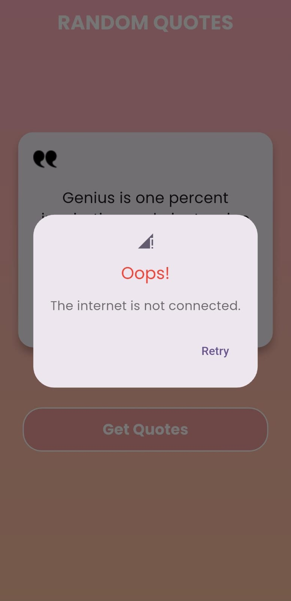

# Random Quotes ✍️

RandomQuotes is a Flutter-based application created for users to get random quotes. The app utilizes Http Library for network calls , connectivity checking with Connectivity plus, MVVM Architecture, Provider State Management.

## Features

- **Random Quotes**: Implemented using a Remote Api endpoint .


## Screenshots

### Home





## Project Structure

The app follows a feature-wise segregation inside the `lib/` directory, ensuring modularity and scalability. Each feature follows the MVVM (Model-View-ViewModel) architecture.

```
lib/
|-- features/
|   |-- home/  (Home screen and dashboard)
|       |-- View (UI Screens)
|       |-- View Model (bridge b/w UI and Business logic)
|       |-- Model (Business Logic)    
|
|-- core/
|   |-- utils/  (Helper classes, constants, and common widgets)
|
|-- main.dart  (Entry point of the app)
```

## Getting Started

Follow these steps to set up the project:

1. Clone the repository:
   ```sh
   git clone https://github.com/Priyansu8603/random_quotes.git
   cd hsdk_assignment
   ```
2. Install dependencies:
   ```sh
   flutter pub get
   ```
3. Configure Firebase:
    - Set up Firebase in your project by following [FlutterFire documentation](https://firebase.flutter.dev/docs/overview/).
    - Add your `google-services.json` (Android) and `GoogleService-Info.plist` (iOS) files to the respective folders.
4. Run the app:
   ```sh
   flutter run
   ```

## Dependencies

The project uses the following dependencies:

- **State Management**: 'Provider'
- **Architecture Followed**: `MVVM Pattern`.

## Contributing

Contributions are welcome! If you'd like to contribute, please follow these steps:

1. Fork the repository.
2. Create a feature branch (`git checkout -b feature-branch`).
3. Commit your changes (`git commit -m 'Add some feature'`).
4. Push to the branch (`git push origin feature-branch`).
5. Create a pull request.


For any issues or queries, feel free to open an issue or contact the project maintainer.

Happy Coding! 🚀

